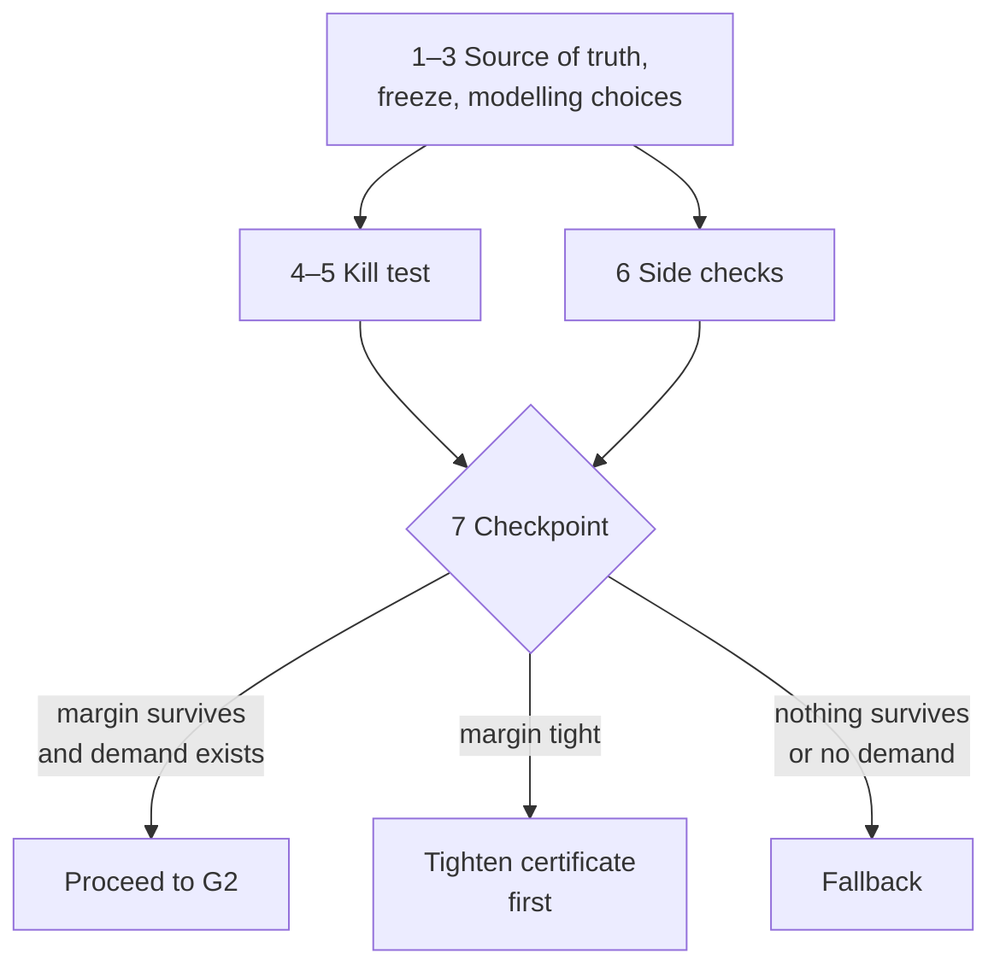

# RoboCert: recommended first target and next steps

Ruby Lin · 26 September 2026 · Source of truth for the first-target work (see §5, step 1).

Target planar precision cell layout sign-off, and do nothing else until a cheap kill test shows the claim survives real tolerances. Every candidate here is an E0 hypothesis; RoboCert could address this problem, it has not solved it.

## 1. Recommended target

A precision assembly integrator, or an in-house automation engineer, fixing fixture, tray and feeder coordinates for a SCARA-style planar cell before steel is cut.

The decision they make: commit to this layout, or move the feeder.

The proposed fit is a cell with fixed geometry where a checkable layout argument could remain useful. Actual clearances, repeatability, calibration error, and demand for such an artifact must be established from a named instance and integrator input; no representative numbers are assumed here.

## 2. The claim, in plain words

The proposed claim asks whether, for link lengths within tolerance, every target point is reachable on one elbow branch with specified singularity and obstacle-clearance margins. An exact, independently recheckable certificate is an objective, not an existing result.

It is design justification for a planar kinematic model, not a safety case and not a motion guarantee. Section 3 makes every term precise, states the claim with explicit quantifiers, and lists what it does not assert.

## 3. Formal statement

The claim is a first-order statement over ℝ with rational data, and the recommended form is the uniform-branch version (U) with a dimensionless singularity margin. Nothing here is certified for any concrete cell; the main statement is an E0 claim schema.

### 3.1 Model and data

All serialized data are rational; quantified lengths and target coordinates range over real sets with rational descriptions. The base, link-length-only instance is D = (L̄, δ, Q, P, ρ, O, r). The proposed O3 zero-offset extension is recorded in [modelling choices](modelling-choices.md); it changes this schema and its quantifier prefix and is not silently part of D.

**Link lengths.** L = (L₁, L₂) ranges over the tolerance box

$$
\Delta = [\bar L_1 - \delta_1,\ \bar L_1 + \delta_1] \times [\bar L_2 - \delta_2,\ \bar L_2 + \delta_2] \subset \mathbb{R}^2_{>0}
$$

**Joint domain.** Q = [q₁⁻, q₁⁺] × [q₂⁻, q₂⁺] ⊂ (−π, π)².

**Kinematics.** With the base at the origin, the end-effector map f_L and the elbow point e_L are

$$
f_L(q) = \begin{pmatrix} L_1\cos q_1 + L_2\cos(q_1+q_2) \\ L_1\sin q_1 + L_2\sin(q_1+q_2) \end{pmatrix}, \qquad e_L(q) = \begin{pmatrix} L_1\cos q_1 \\ L_1\sin q_1 \end{pmatrix}
$$

**Rational parameterisation.** The substitution t_i = tan(q_i / 2) is a bijection (−π, π) → ℝ with

$$
\cos q_i = \frac{1 - t_i^2}{1 + t_i^2}, \qquad \sin q_i = \frac{2 t_i}{1 + t_i^2}
$$

Under it, f_L and e_L are rational maps in (L, t) with rational coefficients and positive denominator (1 + t₁²)(1 + t₂²), and Q becomes the box T = [t₁⁻, t₁⁺] × [t₂⁻, t₂⁺].

**Target set.** R = P ⊕ B̄(0, ρ), where P ⊂ ℚ² is the finite set of nominal pick and place positions, ρ ∈ ℚ≥0 is placement tolerance, B̄ is a closed disc and ⊕ is Minkowski sum.

**Obstacles.** O = O₁ ∪ … ∪ O_m, each O_j a closed convex polygon with rational vertices.

**Link geometry.** Each link is a segment thickened by radius r ∈ ℚ≥0.

Two standing hypotheses:

- **H1 (rational limits).** t_i^± = tan(q_i^± / 2) ∈ ℚ, obtained if necessary by rounding each joint limit inward.
- **H2 (model fidelity).** The physical cell's link lengths lie in Δ and its geometry is as stated. H2 is an assumption about the world; no certificate verifies it.

### 3.2 Singularity margin

For planar 2R the Jacobian determinant factorises, which settles the choice of measure.

$$
\det J_L(q) = \det \frac{\partial f_L}{\partial q}(q) = L_1 L_2 \sin q_2
$$

Two candidate measures:

$$
\sigma_A(L, q) = |\det J_L(q)| = L_1 L_2\,|\sin q_2| \quad [\text{length}^2], \qquad \sigma_B(q) = |\sin q_2| \quad [\text{dimensionless}]
$$

**Lemma 1 (scaling equivalence).** For ε > 0 and L ∈ Δ, with m_Δ = (L̄₁ − δ₁)(L̄₂ − δ₂) and M_Δ = (L̄₁ + δ₁)(L̄₂ + δ₂):

$$
\sigma_B(q) \ge \varepsilon \;\Rightarrow\; \sigma_A(L, q) \ge \varepsilon\, m_\Delta, \qquad \sigma_A(L, q) \ge \varepsilon' \;\Rightarrow\; \sigma_B(q) \ge \varepsilon' / M_\Delta
$$

*Proof.* Immediate from the factorisation and L₁L₂ ∈ [m_Δ, M_Δ]. ∎

Recommendation: use σ_B. Its threshold does not change with units, and any σ_A requirement converts to it by Lemma 1. In the rational parameterisation it is a polynomial inequality with no square root:

$$
\sigma_B(q) \ge \varepsilon \iff 4 t_2^2 \ge \varepsilon^2 (1 + t_2^2)^2
$$

**Lemma 2 (reach annulus).** Let L ∈ ℝ²₊, x ∈ ℝ² and ε ∈ (0, 1]. Ignoring joint limits and obstacles, there exists q with f_L(q) = x and σ_B(q) ≥ ε if and only if

$$
\left( \|x\|^2 - L_1^2 - L_2^2 \right)^2 \le (1 - \varepsilon^2)\,(2 L_1 L_2)^2
$$

*Proof.* By the law of cosines, ‖f_L(q)‖² = L₁² + L₂² + 2L₁L₂ cos q₂, so any solution forces cos q₂ = c := (‖x‖² − L₁² − L₂²) / (2L₁L₂), and sin² q₂ = 1 − c² ≥ ε² is the displayed inequality. Conversely, if it holds then |c| < 1, q₂ = ± arccos c gives |sin q₂| ≥ ε, and since the vector (L₁ + L₂ cos q₂, L₂ sin q₂) has norm ‖x‖, a rotation angle q₁ with f_L(q) = x exists. ∎

Consequence: reachability together with the margin reduces to a polynomial inequality in (x, L) alone. Joint limits and clearance are where the configuration-space work actually lies.

### 3.3 Clearance

The arm's occupied set is the union of its two link segments, thickened by r:

$$
A_L(q) = \big( [0,\, e_L(q)] \cup [e_L(q),\, f_L(q)] \big) \oplus \bar B(0, r)
$$

For μ > 0, since thickening by r lowers distance by exactly r, the clearance requirement splits into finitely many segment–polygon conditions:

$$
\operatorname{dist}\big(A_L(q), O\big) \ge \mu \iff \operatorname{dist}\big(S_k(L,q), O_j\big) \ge \mu + r \quad \text{for } k = 1, 2,\ j = 1, \dots, m
$$

where S₁ = [0, e_L(q)] and S₂ = [e_L(q), f_L(q)].

**Proposition 3 (separating-line form).** Let η > 0, S = [s₀, s₁] a segment and O_j = conv{v₁, …, v_k} a polygon. Then dist(S, O_j) ≥ η if and only if there exist a ∈ ℝ² and b ∈ ℝ with

$$
\|a\|^2 \le 1, \qquad a \cdot s_i \le b \ \ (i = 0, 1), \qquad a \cdot v_l \ge b + \eta \ \ (l = 1, \dots, k)
$$

*Proof.* (⇐) The linear conditions extend to all convex combinations, so a · (o − s) ≥ η for every s ∈ S and o ∈ O_j, and a · (o − s) ≤ ‖a‖ ‖o − s‖ ≤ ‖o − s‖. (⇒) Take a closest pair (s\*, o\*), set a = (o\* − s\*) / ‖o\* − s\*‖ and b = a · s\*; the separating hyperplane theorem for disjoint compact convex sets gives the conditions with margin ‖o\* − s\*‖ ≥ η. ∎

Why this form: the endpoints s_i are rational functions of (L, t), the conditions are polynomial after clearing positive denominators, and no square root appears. Parametric separation is relevant to the [C-Iris method recorded as LIT-001](../../research/literature/LIT-001.md); translating any of its guarantees to this proposed domain remains a separate obligation. The relaxation ‖a‖² ≤ 1 instead of ‖a‖ = 1 is sound and loses nothing in Proposition 3.

### 3.4 The claim, formally

Fix ε ∈ (0, 1] and μ > 0, both rational. A configuration is admissible for L when it respects joint limits, the margin and the clearance:

$$
\mathrm{Adm}_D(L, q;\, \varepsilon, \mu) \;:\!\iff\; q \in Q \;\wedge\; \sigma_B(q) \ge \varepsilon \;\wedge\; \operatorname{dist}\big(A_L(q), O\big) \ge \mu
$$

The two elbow branches are Q_b = { q ∈ Q : b · sin q₂ > 0 } for b ∈ {+1, −1}.

**Lemma 4 (at most one solution per branch).** If (‖x‖² − L₁² − L₂²)² < (2L₁L₂)², then f_L(q) = x has at most one solution in each Q_b.

*Proof.* By the law of cosines cos q₂ = c with |c| < 1, so q₂ = b · arccos c is fixed by the branch; q₁ is then fixed modulo 2π by the direction of x, and Q ⊂ (−π, π)² admits at most one representative. ∎

**Claim (P), pointwise branch.**

$$
\forall L \in \Delta\ \ \forall x \in R\ \ \exists q:\quad f_L(q) = x \;\wedge\; \mathrm{Adm}_D(L, q;\, \varepsilon, \mu)
$$

**Claim (U), uniform branch.**

$$
\exists b \in \{+1, -1\}\ \ \forall L \in \Delta\ \ \forall x \in R\ \ \exists q \in Q_b:\quad f_L(q) = x \;\wedge\; \mathrm{Adm}_D(L, q;\, \varepsilon, \mu)
$$

By Lemmas 2 and 4, the witness q in (U) is unique for each (L, x), so (U) is equivalently a statement about one explicit inverse-kinematics map g_{L,b}: R → Q_b.

**Proposition 5 (why U, not P).** (U) implies (P); the converse fails in general. Moreover, any continuous curve in Q joining a point of Q₊₁ to a point of Q₋₁ contains a configuration with σ_B = 0.

*Proof.* The implication is immediate. For a counterexample to the converse, take L₁ = L₂ = 1, δ = ρ = r = 0, P = {(1, 1), (1, −1)}, ε = μ = 1/2, q₁ ∈ [−2 arctan(1/2), 2 arctan(1/2)], q₂ ∈ [−π/2, π/2], and O = [10, 11]². The two targets have admissible solutions (q₁, q₂) = (0, π/2) and (0, −π/2), respectively. Their opposite-branch solutions require q₁ = π/2 and q₁ = −π/2, outside Q. The arm stays inside the radius-2 disc, so the obstacle clears it by more than μ. Thus (P) holds but neither uniform branch works. For the final statement, sin q₂ is continuous along a path changing branch sign, so it vanishes somewhere by the intermediate value theorem. ∎

Proposition 5 is a fact about the configuration space, not a motion claim. Its practical reading: under (P), a certified cell may still need the arm to change elbow branch between two targets, and every such change passes through a singular configuration. (U) rules that out, which is why it is the recommended form for layout sign-off.

**Status.** No concrete instance is certified here. This is an E0 claim schema, not an established theorem or a production result.

### 3.5 Certificate and checker

Write Φ_D(ε, μ) for Claim (U) with the branch b fixed. By §§3.1–3.3, Φ_D is a first-order formula over the reals with rational coefficients, of the form ∀(L, x) ∃q. Quantifier elimination establishes decidability in principle, but no checker or complete certificate format for this claim exists here.

**Candidate certificate sketch, not a complete format.** A possible finite object is C = (b, (K_i, w_i) for i = 1, …, N), where:

- the cells K_i are rational parameter cells with an exact proof that their domain-restricted union covers Δ × R, including every curved disc boundary;
- each witness w_i must establish, on its cell, exact FK equality, the common branch sign, commanded joint limits, the singularity margin, and all actual-link separating-line conditions;
- each inequality p ≥ 0 on a cell is carried by a polynomial identity with rational coefficients, for instance

$$
p = \sigma_0 + \sum_k \sigma_k\, g_k, \qquad \sigma_k = z_k^{\top} G_k\, z_k,\ \ G_k \in \mathbb{Q}^{n_k \times n_k},\ G_k \succeq 0
$$

where the g_k ≥ 0 describe the cell and the z_k are monomial vectors.

**Proposed checker obligations.** A future procedure Check(D, C) ∈ {accept, reject}, using exact arithmetic only, would need at least:

1. **Cover.** Check exact coverage of the declared semialgebraic parameter domain, not merely a box containing it.
2. **Witness.** Isolate algebraic IK roots, check the chosen branch, denominator signs, FK identities, and all quantified witness dependencies.
3. **Identities and positivity.** Check every identity in the appropriate rational or algebraic quotient ring, every domain condition and separator, and every exact PSD obligation, including zero-pivot cases.

**Soundness requirement.**

$$
\mathrm{Check}(D, C) = \mathrm{accept} \;\Longrightarrow\; \Phi_D(\varepsilon, \mu)
$$

This implication is an **unresolved proof obligation**, not a theorem established by this document. The O5 witness construction and its implementation correspondence remain open.

**Exactness requirement.** Rational input data do not make the proposed IK witnesses rational. The checker must use an exact algebraic representation and establish root selection, signs, identities, coverage, and PSD without trusting numerical reconstruction. RoboCert has an unregistered exact SOS utility ([RC-006](../../research/CLAIMS.md#rc-006)); that utility does not check this proposed certificate family.

**What the checker would not establish.** Hypothesis H2; completeness, since rejection would not mean Φ_D is false; and nothing in §3.6. [O5](modelling-choices.md#o5-concrete-proposal) sketches how to discharge ∃q, but that construction has not been proved or checked.

### 3.6 What the statement does not assert

Φ_D is a statement about the static map (L, q) ↦ (f_L(q), A_L(q)) under the model of §3.1. Stated as exclusions:

- **No curves.** It makes no statement about any curve γ: [0, 1] → Q, so nothing about executing a sequence of targets. Proposition 5 describes the configuration space; it is not a path guarantee.
- **No time or dynamics.** No velocities beyond what σ_B ≥ ε implies about invertibility of J_L, and no torques, inertia, controller behaviour or contact forces.
- **No safety.** No statement about harm to people, and no claim of compliance with ISO 10218 or any other safety standard.
- **Planar projection only.** A SCARA's vertical axis and tool rotation are outside the model; the claim concerns the two planar joints.
- **Model-relative truth.** Φ_D holds for the model under H1 and H2. Whether the physical cell satisfies H2 is not verified, and any change to D voids the certificate.

### 3.7 Open modelling choices

Each choice changes what the certificate proves; none should be settled silently in code. [The O1–O6 planning record](modelling-choices.md) proposes an augmented schema, including O3 and O5. It is not evidence that the claim holds.

| ID | Choice | Options | Recommendation |
|--------|--------------------|------------------------------------------------|--------------------------------------------------|
| O1 | IK branch | (P) branch may vary per target; (U) one branch for all of R | (U), by Proposition 5 |
| O2 | Margin measure | σ_A = \|det J_L\|; σ_B = \|sin q₂\|; condition number of J_L | σ_B, by Lemma 1; the condition number depends on L and q jointly and is unit-sensitive unless lengths are normalised |
| O3 | Tolerance model | Link lengths only; plus joint zero offsets β, with q ↦ q + β; plus base offset τ ∈ B̄(0, ρ_b) | At minimum add the q₂ offset, which shifts σ_B directly. Base offset can be handled soundly but conservatively by replacing R with R ⊕ B̄(0, ρ_b) and O with O ⊕ B̄(0, ρ_b), which decouples the shared τ |
| O4 | Target set | Finite P ⊕ B̄(0, ρ); finite union of rational polygons | P ⊕ B̄(0, ρ): it matches discrete pick positions with placement tolerance |
| O5 | Discharging ∃q | Algebraic witnesses on the variety f_L(q) = x; image covering of R by f_L over cells of Δ × Q_b | Open; decide against the existing RC-002 encoding before the kill test is coded |
| O6 | Link geometry | Segments thickened by r; general convex polygons | Segments with r, which keeps Proposition 3 to two endpoints per link |

## 4. Why this target

This proposal combines reachability, margins, and tolerance semantics not established by RoboCert's current fixed-instance checker. Whether another method already establishes the same claim remains a literature question.

| Method | What it gives | What it leaves open |
|-------------------------|------------------------------------------------|------------------------------------------------|
| CAD reach study, offline simulation | Reachability at sampled waypoints, nominal geometry | Behaviour between samples; points that pass reach but are near-singular and fail at commissioning |
| SCARA layout optimisation | A potential comparison to investigate | Whether its published formulation proves a uniform margin is unverified here |
| C-Iris ([LIT-001](../../research/literature/LIT-001.md)) | Candidate collision-free configuration-space regions under its stated assumptions | Does not by itself establish this proposal's target, margin, and tolerance quantifiers |

Exact checking matters at the decision boundary: a sampled or floating-point result does not establish a universal inequality or the exact sign of a small margin. An approximate SOS candidate likewise needs exact reconstruction and checking before it could support this claim.

## 5. Next steps

Every step narrows scope and ends in something written down; the failure to guard against is drifting back into "continue the roadmap".

| # | Step | Done when |
|-----|------------------------------------------------------------|----------------------------------------|
| 1 | Make this reviewed document the planning source of truth | The repository copy is canonical; subsequent corrections remain visible in Git history |
| 2 | Freeze the roadmap: no G2 work, no RC-002 changes beyond what the kill test needs | Freeze noted in `revised-direction.md` |
| 3 | Settle the open modelling choices O1–O6 of §3.7 | Each choice recorded, with its reason |
| 4 | Fix the instance D from one real SCARA datasheet and one real tray footprint | Every input marked datasheet or assumption |
| 5 | Run the kill test of §6, and only the kill test | `docs/strategy/kill-test-result.md` exists |
| 6 | Run the two side checks of §7 as separate tasks, in parallel with step 5 | Each has a one-page written finding |
| 7 | Decide at one checkpoint, weighing the kill test and side checks together | Dated decision written into `revised-direction.md` |

The side checks feed the same checkpoint on purpose: a technically surviving margin with no one who wants the certificate is still a reason to take the fallback.

## 6. The kill test

Question: for one realistic instance D, does the integrator's requirement (ε_req, μ_req) survive a plausible tolerance δ?

**Inputs,** each taken from a named datasheet or marked as an assumption:

1. L̄₁, L̄₂ and δ, covering manufacturing plus calibration error — this fixes Δ.
2. The pick and place set P and placement tolerance ρ — this fixes R. Use the actual tray footprint, not a generous rectangle.
3. The obstacle polygons O and link radius r, with the true available clearance.
4. ε_req, derived from tolerable velocity amplification rather than chosen for convenience, and μ_req.

**Rules.**

- Stop after fixing inputs and get approval before computing. Invented numbers presented as real are the largest risk in this step.
- Reuse RC-002's encoding and witness polynomials; add only what the test needs.
- No floating point in any step the result depends on.

**Formal decision.** For a fixed branch b, the feasible set is

$$
F_D = \{ (\varepsilon, \mu) \in (0, 1] \times \mathbb{Q}_{>0} \;:\; \Phi_D(\varepsilon, \mu) \}
$$

**Lemma 6 (monotonicity).** F_D is downward closed: (ε, μ) ∈ F_D, ε′ ≤ ε and μ′ ≤ μ imply (ε′, μ′) ∈ F_D. It can only grow when Δ, R or O shrink; in particular it is non-increasing in δ.

*Proof.* Every condition in Adm_D is a threshold inequality, and shrinking Δ, R or O removes universally quantified cases or obstacle constraints. ∎

Two kinds of exact evidence locate the requirement:

- **Inner evidence, conditional.** An accepted certificate from a future checker whose soundness and implementation correspondence have been established would prove (ε_in, μ_in) ∈ F_D.
- **Outer evidence.** A rational point (L\*, x\*) ∈ Δ × R at which the unique candidate of Lemma 4 in Q_b fails Adm_D(ε_out, μ_out), proving (ε_out, μ_out) ∉ F_D. The candidate's half-angle t₂ lies in a quadratic extension of ℚ, so this check is exact but not purely rational.

| Outcome | Formal condition at (ε_req, μ_req) | Reading | Action |
|----------------|------------------------------|------------------------------|--------------------------|
| Proceed | Inner evidence | The distinctive claim is real for this D | Proceed to G2 |
| Unresolved | Neither inner nor outer evidence | The reason is unknown; no failure mode has been established | Diagnose before deciding whether to tighten or stop |
| Fallback | Outer evidence for both branches | Claim (U) provably fails for this D | Take the fallback |

The fallback row would require an exact, in-domain counterexample for both branches; no such result exists yet. Do not call a computed ε or μ certified without checked supporting evidence.

## 7. Side checks

Two cheap checks, each run as its own task so neither leaks into the kill test.

### 7.1 Demand: does anyone value exactly rechecked certificates?

Demand for a rechecked robotics certificate has not been established. Claims about aviation certification credit or tool qualification need a separate primary-source and regulatory review before use as project evidence.

- **Check:** ask two or three integrators what evidence they hand over at cell acceptance, and whether a reach or singularity claim has ever been disputed after handover.
- **Weakened by:** no customer ever asking for an analytical artifact; sign-off test-based and schedule-driven.
- **Refuted by:** a customer or notified body rejecting analytical evidence for this class of claim.

### 7.2 C-IRIS exactness gap

Whether published robot configuration-space certificates are independently rechecked in exact arithmetic is unverified. Investigate both certificate export and any existing exact or validated recheck before claiming a gap.

- **Check:** read the Drake C-IRIS certificate-verification path; see whether the SDP is wrapped in verified or interval arithmetic. About one afternoon.
- **Refuted by:** existing rational rounding or verified SDP on C-IRIS separating-hyperplane certificates.

## 8. Checkpoint, fallback and project scope

One decision, taken once both the kill test and the side checks have reported, written into `revised-direction.md` with its date and the evidence it rests on.

**Fallback.** If the margin does not survive, or no buyer wants the certificate, switch to the exact checker of §3.5 as a detachable artifact: a certificate that travels with a layout proposal and is rechecked by a small rational-arithmetic program with no solver in it. It does not depend on a tight inflated margin. Its own blocker is export — if rechecking needs RoboCert internals, the result is a second solver, not a checker.

**Out of project scope,** whichever way the checkpoint goes (the claim's own exclusions are in §3.6):

- 6- and 7-DOF planning in cluttered scenes; scaling claims about other tools require separate verification.
- Human-robot collaborative safety and standards compliance; this model makes neither claim.
- High-mix cells whose layout changes often enough that a fixed-geometry certificate goes stale.

## Unverified research leads

The links below are leads for later source checks, not verified `LIT-xxx` entries and not evidence for the claim or checker sketch above. [LIT-001](../../research/literature/LIT-001.md) is the sole literature entry used here.

- [Certified Polyhedral Decompositions of Collision-Free Configuration Space](https://arxiv.org/pdf/2302.12219)
- [Singularity avoidance for SCARA robots](https://www.sciencedirect.com/science/article/abs/pii/092188909290015Q)
- [Computer-Assisted Proofs for Lyapunov Stability via SOS](https://arxiv.org/html/2006.09884v2)
- [Sums of squares in Macaulay2](https://arxiv.org/pdf/1812.05475)
- [Explicit Separators for Consecutive Levels of Parrilo's Hierarchy](https://arxiv.org/pdf/2608.27743)
- [DO-333 Certification Case Studies](https://loonwerks.com/publications/pdf/cofer2014nfm.pdf)
- [Qualification of a Model Checker for Avionics Software Verification](https://link.springer.com/chapter/10.1007/978-3-319-57288-8_29)
- [ISO 10218:2025 explained](https://theresarobotforthat.com/blog/iso-10218-2025-explained/)
